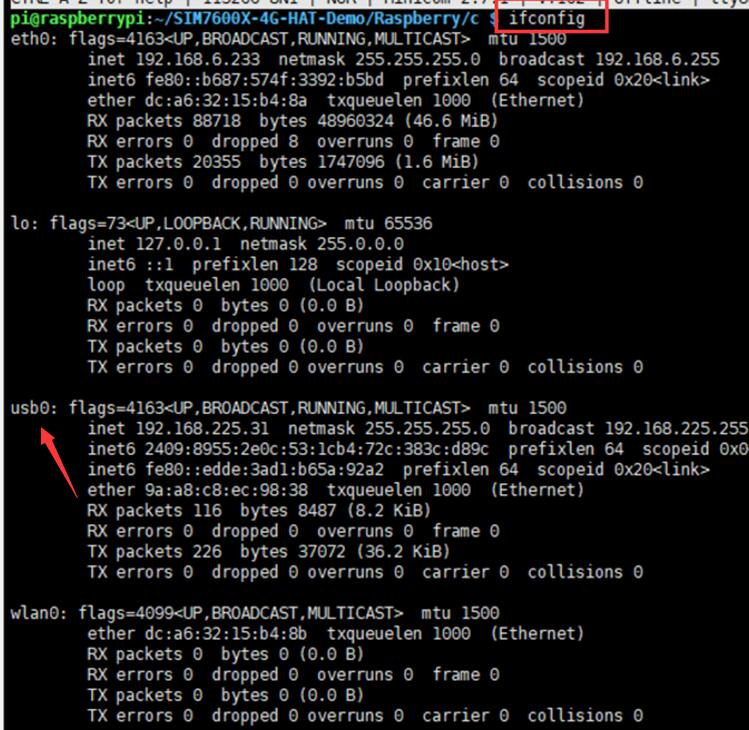

# SIM7600X 4G DONGLE 構成

```
https://www.waveshare.com/wiki/SIM7600G-H_4G_DONGLE
```

## インターネット接続の設定
```
https://www.waveshare.com/wiki/Raspberry_Pi_networked_via_RNDIS
```

## ハードウェア接続の準備
SIM7600X 4G DONGLE
4G Nano SIM カード
(カードは動作可能で、4G にアクセスできる必要があります)

## Raspberry Pi (Raspbian) の 4G 接続を設定する


## 1. まずポートを開く
以下のコマンドを実行してttyUSB2が正常に認識されるかどうかを確認し、正常に認識された場合はminicom経由でポートを開きます。
```
ls /dev/ttyUSB*
sudo minicom -D /dev/ttyUSB2
```

## 2.モジュールのPIDを変更するコマンドを実行する
minicom経由で次のコマンドを送信し、モジュールが再起動するのを待ちます。
```
AT+CUSBPIDSWITCH=9011,1,1
```


## 3.AT コマンド実行後に IP ルートを確認する
ifconfig コマンドを実行して、USB0 カードが識別されているかどうかを確認します
```
ifconfig
```


## 4.IP addressを取得する


## 5.インターネット接続を確認する
次のコマンドを使用して、
usb0 ワイヤレス ネットワーク カード経由で Baidu Web サイトに ping を実行し、
インターネットに正常に接続できるかどうかをテストします。
```
ping -I usb0 www.baidu.com
```

## もし、PIDが9011でIPの確認ができない場合PIDをリセット
```
AT+CUSBPIDSWITCH=9001,1,1
```

## 9018に変更する
```
AT+CUSBPIDSWITCH=9018,1,1
```
